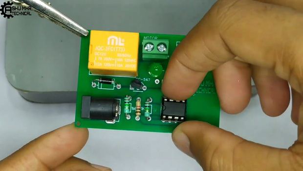
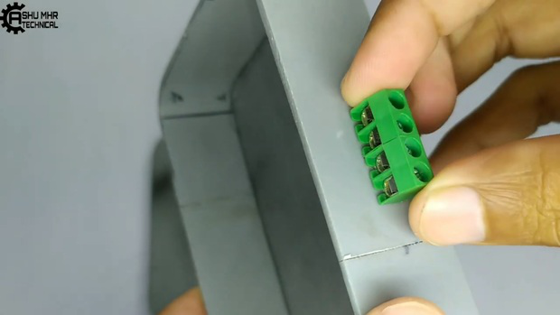

> **Story**
>
> by
>
> This is a very interesting yet simple project for making Waterpump
> control the water level smartly. We called this project a **\"Smart
> Waterpump**
>
> By following this guide, you will be able to know and make your . This
> projectguide contains the files necessary to help you step by step
> produce your own Smart Waterpump Starter Please follow the steps of
> the project to get a positive result.
>
> **Disclaimer:** Be extra careful with this project as it produces a
> High Voltage - High Current output.
>
> **Supplies:**
>
> Get all the components shown in the images.

> **Step 1: Step 1**

**Get your PCB ready!**

**Talking About Electronics**

> After making the circuit diagram I transformed it into a PCB design to
> produce it, to produce the PCB, I have chosen the best PCB supplier,
> and the cheapest PCB provider to order my circuit. with the reliable
> platform, all I need to do is some simple clicks to upload the Gerber
> file and set some parameters like the PCB thickness color and quantity.
> I've paid just 2 Dollars to get my PCB after five days only, what I
> have noticed about this time is the \"out-of-charge **PCB color PCB
> color**\" which means you will pay only 2
>
> USD for any PCB color you choose.

**Related Download Files**

> As you can see in the pictures above the PCB is very well manufactured
> and I've got the same PCB design that we've made for our main board
> and all the labels and logos are there to guide me during the
> soldering steps. You can also download the Gerber file for this circuit
> from the download link below in case you want to place an order for
> the same circuit design.

**Step 2: Step 2**

> Place all the components on PCB and solder it properly.

**Step 3: Step 3**

> After soldering the components to PCB, connect one wire of 3pin plug
> to the screw terminal of PCB. Take 4pin screw terminal and stick it to
> the custom-designed box.\
> Solder all the remaining 3wires of PCB to the 4pin screw terminal.

**Step 4: Step 4**

> **Take** a 2pin plug and connect one end to the end of the socket in
> which PCB wire is already connected. **Connect other end** of 2pin
> plug to the screw terminal of PCB as shown in the images.

**Step 5: Final Step**

Connect the 12v adapter to the circuit, also connect the plug of the
pump to the circuit & Smart Waterpump Starter is now ready to
automatically turn on & off waterpump.

> New users will also get some coupons while registering at via this
> blue link.

